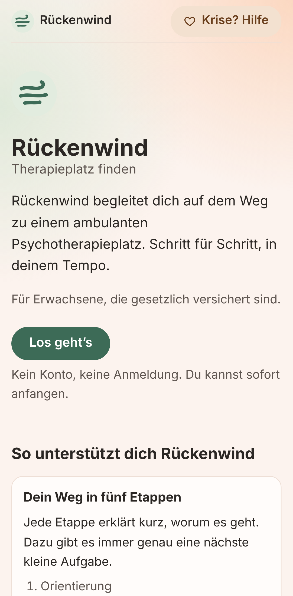
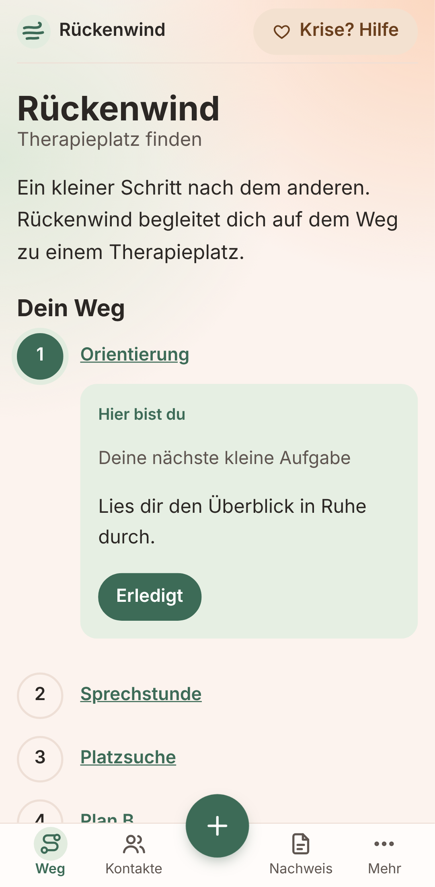
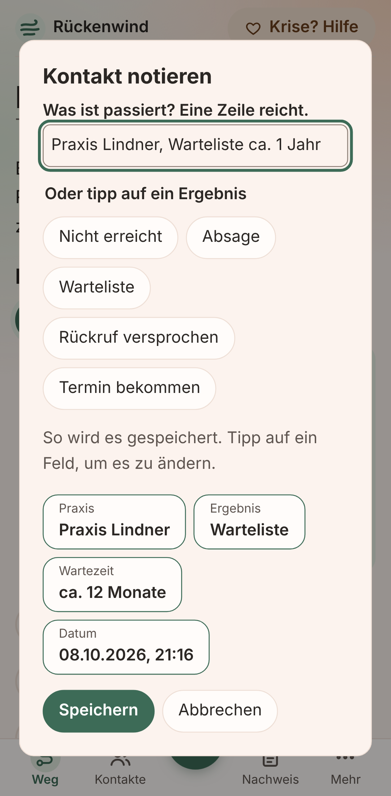
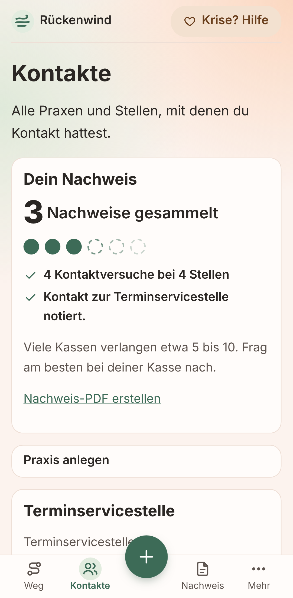
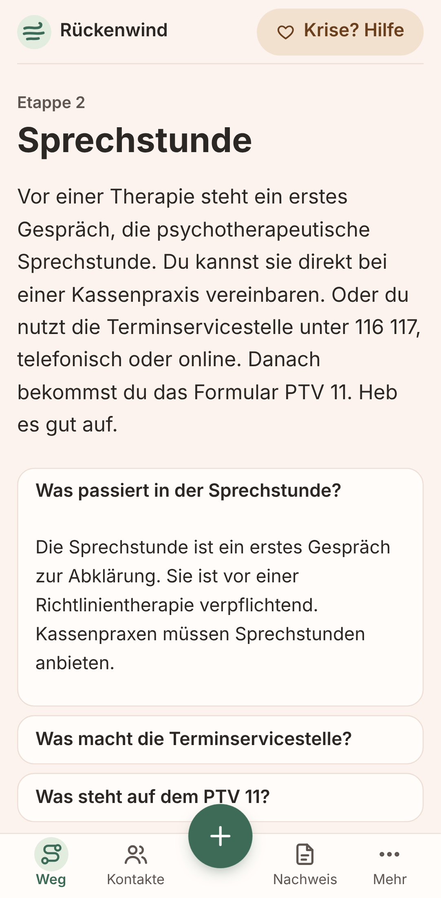
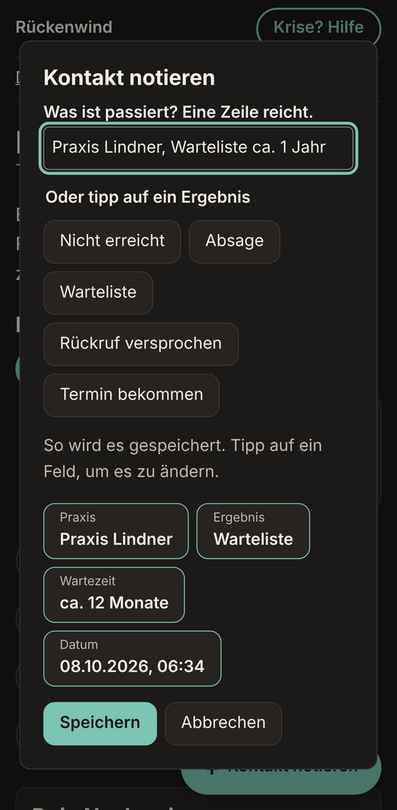

# Rückenwind – Therapieplatz finden

[](https://github.com/sebiweise/rueckenwind/actions/workflows/ci.yml)
[](https://sonarcloud.io/summary/new_code?id=sebiweise_rueckenwind)
[](LICENSE)
[](content/LICENSE)

Rückenwind ist eine Open-Source-Web-App (PWA), die gesetzlich Versicherte in Deutschland auf dem Weg zu einem ambulanten Psychotherapieplatz begleitet. Sie erklärt die Schritte verständlich, schlägt immer genau eine nächste kleine Aufgabe vor und dokumentiert jeden Kontaktversuch nebenbei. Am Ende entsteht daraus ein Nachweis-PDF für das Kostenerstattungsverfahren.

> **Status:** MVP fertig, Version 0.1.0 in Vorbereitung. Die Infotexte werden vor dem ersten Release noch fachkundig geprüft.

> **Akute Krise?** Warte nicht auf einen Therapieplatz. Notruf **112**, Telefonseelsorge **0800 111 0 111** oder **0800 111 0 222** (kostenfrei, rund um die Uhr, auch Chat auf [telefonseelsorge.de](https://www.telefonseelsorge.de)) oder die psychiatrische Notaufnahme einer Klinik in deiner Nähe.

## Warum

Wer keinen Kassenplatz findet, ruft viele Praxen an, oft nur in kurzen Telefonsprechzeiten. Für die Kostenerstattung verlangen Kassen eine Liste erfolgloser Anfragen. Das ist anstrengend, gerade in einer belastenden Lage. Rückenwind soll die Suche leichter machen: Jeder Anruf, auch eine Absage, zählt sichtbar als Fortschritt.

## Screenshots

| Einführung                                                                  | Dein Weg                                                                          | Kontakt notieren                                                           | Kontakte                                                             | Etappe                                                                       |
| --------------------------------------------------------------------------- | --------------------------------------------------------------------------------- | -------------------------------------------------------------------------- | -------------------------------------------------------------------- | ---------------------------------------------------------------------------- |
|  |  |  |  |  |

Dunkelmodus: 

Screenshots neu erzeugen: Server starten (`npm start` mit `PORT=4173`), dann `node scripts/screenshots.mjs`. Alle Daten darin sind erfunden.

## Was die App kann

- **Kurze Einführung:** Die Startseite (`/`) erklärt die Idee und wie du anfängst. Die App selbst liegt unter `/app/`; die installierte App startet direkt dort.
- **Dein Weg:** fünf Etappen von der Orientierung bis zum Antrag, immer mit genau einer nächsten kleinen Aufgabe.
- **Kontakt in einer Zeile notieren:** „Praxis Weber, AB, Warteliste 8 Monate“ wird lokal erkannt und als Vorschau gezeigt. Korrigieren per Tipp, speichern mit einem Tipp. Dazu Schnellbuttons.
- **Kontakte und Fortschritt:** alle Praxen mit Telefonzeiten und Kontaktversuchen. Absagen zählen sichtbar als gesammelte Nachweise.
- **Nachweis-PDF:** eine Liste aller Anfragen für den Antrag auf Kostenerstattung, erzeugt im Browser.
- **Sichern, wiederherstellen, löschen:** als JSON-Datei, ohne Konto.
- **Offline nutzbar und installierbar** (PWA), hell und dunkel, drei Farbthemen zur Wahl (Salbei, Pfirsich, Himmel), barrierearm (WCAG 2.2 AA als Ziel).
- **Krisenhilfe** auf jeder Seite erreichbar.

## Datenschutz-Versprechen

- **Deine Daten bleiben auf deinem Gerät.** Alles wird nur im Browser gespeichert (IndexedDB).
- **Kein Konto, kein Server, kein Tracking.** Keine Analytics, keine externen Fonts, keine CDNs.
- **Keine Verbindungen nach außen.** Eine Content-Security-Policy erlaubt nur Anfragen an die eigene Seite. Inline-Skripte sind nur mit ihrem Hash erlaubt (beim Build berechnet). Automatische Tests prüfen das.
- **Sicherung nur per Datei.** Du kannst deine Daten als JSON exportieren, wieder importieren und jederzeit vollständig löschen.

## Hinweis

Rückenwind informiert und hilft beim Organisieren. Die App ist **keine Rechts- oder Medizinberatung**, stellt keine Diagnosen und gibt keine Garantie, dass ein Antrag bewilligt wird. Die Infotexte werden vor dem ersten Release fachkundig geprüft.

## Entwicklung

Voraussetzung: Node.js 22.18 oder neuer (siehe `.nvmrc`).

```sh
npm ci              # Abhängigkeiten installieren
npm run dev         # Entwicklungsserver
npm run lint        # Prettier + ESLint
npm run check       # Typprüfung (tsc)
npm test            # Unit-Tests (Vitest)
npm run test:coverage   # Unit-Tests mit Abdeckung (Domäne ≥ 90 %)
npm run test:e2e    # E2E-Tests (Playwright + axe-core); vorher einmal: npx playwright install chromium
                    # oder vorhandenes Chromium nutzen: PLAYWRIGHT_CHROMIUM_PATH=/pfad/zu/chrome
npm run build       # Produktions-Build (Standalone-Server)
npm start           # Produktions-Build starten (http://localhost:3000)
```

Tech-Stack: Next.js + React + TypeScript, Plain CSS, Vitest, Playwright. Details, Datenmodell und Phasen stehen im [Umsetzungsplan](docs/PLAN.md), das Fachwissen in [docs/WISSEN.md](docs/WISSEN.md).

### Projektstruktur

```
content/de/          Infotexte als Markdown (CC BY-SA 4.0)
docs/                Plan und Wissensstand
e2e/                 End-to-End-Tests
src/app/             Seiten und Layout
src/components/      UI-Komponenten
src/lib/domain/      reine Logik ohne Framework (Parser, Etappen, Fortschritt)
src/lib/data/        lokale Datenhaltung, Export/Import
src/lib/i18n/        UI-Texte
```

## Hosting

Rückenwind braucht kein Backend. Der Server liefert nur die App aus, deine Daten bleiben im Browser. Du hast vier Möglichkeiten:

**1. Docker** (Next.js-Standalone-Server)

```sh
docker run -p 3000:3000 ghcr.io/sebiweise/rueckenwind:latest
# oder selbst bauen:
docker build -t rueckenwind . && docker run -p 3000:3000 rueckenwind
# oder mit Compose:
docker compose up -d
```

Das Image läuft als unprivilegierter Nutzer, verträgt ein schreibgeschütztes Dateisystem und hat einen Healthcheck. Port und Adresse lassen sich über `PORT` und `HOSTNAME` ändern.

**2. Beliebiger Node-Host** (Node 22.18 oder neuer)

```sh
npm ci && npm run build && npm start
```

**3. Vercel oder ein anderer Next.js-Hoster**

Repository importieren, fertig. Es ist keine weitere Konfiguration nötig; Vercel erkennt Next.js selbst. Bitte Vercel Analytics und Speed Insights ausgeschaltet lassen, die App verzichtet bewusst auf Tracking.

**4. Statischer Export** (GitHub Pages, Netlify, ein einfacher Webserver)

```sh
npm run build:static            # schreibt die Seite nach out/
BASE_PATH=/rueckenwind npm run build:static   # wenn die App unter einem Unterpfad liegt
```

Nach dem Build läuft `scripts/postbuild.mjs`: Es fügt in jede Seite eine CSP ein, die Inline-Skripte nur per Hash erlaubt, baut den Service Worker (`sw.js`, Serwist) für die Offline-Nutzung und legt alles an die richtige Stelle. Wer selbst hostet und ein Impressum braucht, legt `content/de/impressum.md` an; es erscheint dann auf der Über-Seite.

Die GitHub-Pages-Variante baut und veröffentlicht der Workflow `pages.yml` bei jedem Push auf `master`. Ein statischer Host kann keine HTTP-Header setzen; die Content-Security-Policy steckt deshalb zusätzlich als Meta-Tag in jeder Seite.

## Mitmachen

Die Infotexte liegen als Markdown in [`content/de/`](content/de/README.md). Korrekturen daran sind besonders willkommen, auch ohne Programmierkenntnisse. Wie das geht, steht in [CONTRIBUTING.md](CONTRIBUTING.md). Bitte beachte den [Verhaltenskodex](CODE_OF_CONDUCT.md).

## Lizenz

- Code: [MIT](LICENSE)
- Inhalte in `content/`: [CC BY-SA 4.0](content/LICENSE)
